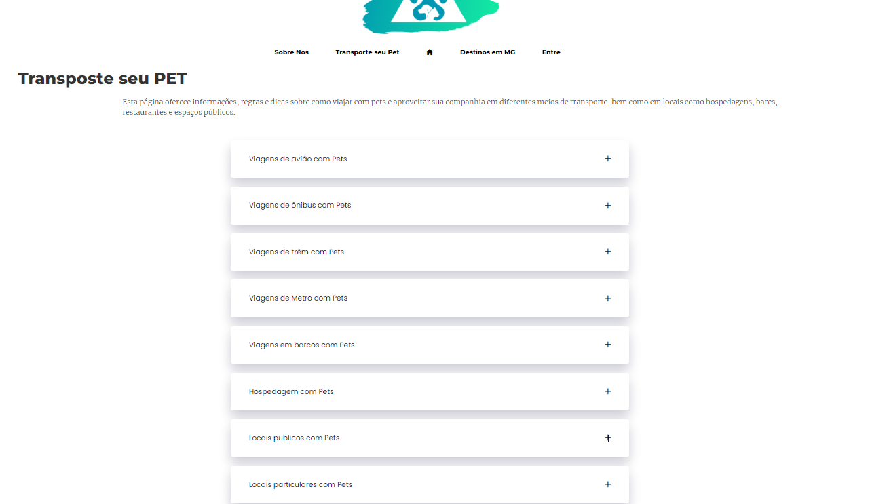
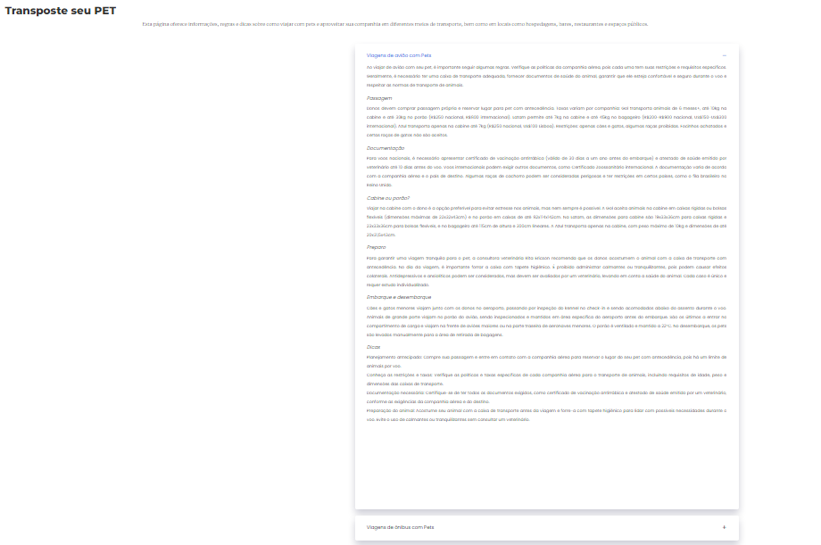
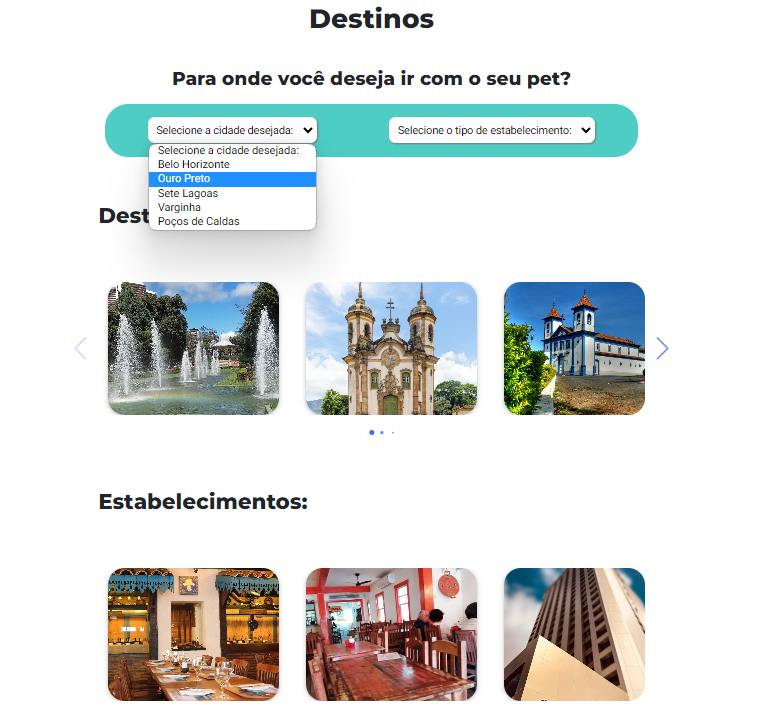
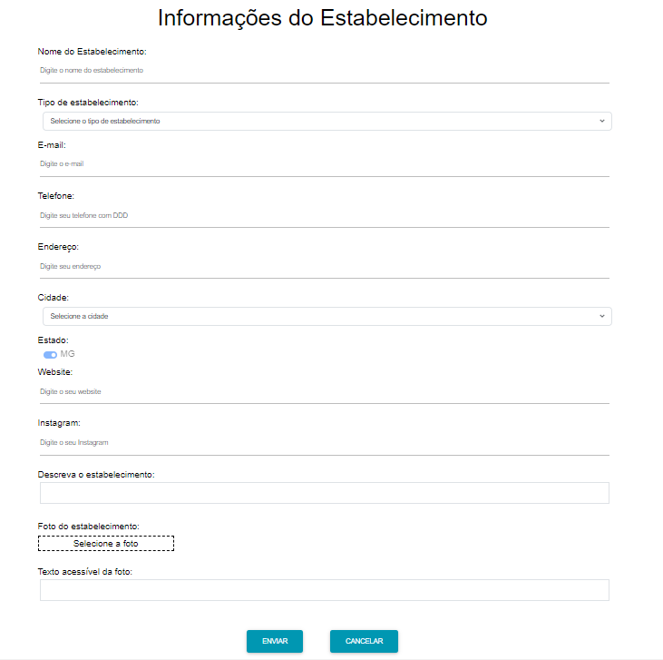

# Programação de Funcionalidades
Nesta seção, você encontrará informações sobre os artefatos e estruturas de dados desenvolvidos para cumprir os requisitos estabelecidos nas Especificações do Projeto. Também fornecemos instruções para acessar e verificar a implementação. As tecnologias empregadas incluem as linguagens HTML, CSS e JavaScript.

## Requisitos Atendidos

## Informações 
### Requisitos Funcionais

|ID    | Descrição do Requisito | Prioridade | Artefato Criado |
|------|------------------------|------------|-----------------|
|RF-001| Disponibilizar área com informações com regras de viagem de avião com pet | ALTA | transporte.html| 
|RF-002| Disponibilizar área com informações com regras de viagem de ônibus com pet | ALTA | transporte.html| 
|RF-003| Disponibilizar área com informações com regras de viagem de carro com pet | ALTA | transporte.html|   
|RF-004| Disponibilizar área com informações de hospedagens *pet friendly* em Minas Gerais | ALTA | transporte.html|   
|RF-005| Disponibilizar área com informações de estabelecimentos comerciais privados *pet friendly* em Minas Gerais | ALTA | transporte.html|  
|RF-006| Disponibilizar área com informações de locais públicos *pet friendly* em Minas Gerais | ALTA | transporte.html|  

Para atender aos requisitos RF-001, RF-001, RF-002, RF-003, RF-004, RF-005 e RF-006 foi desenvolvido a página Transporte.
Ao acessar a página Transporte, será exibo seções descrevendo os informações e dicas de viagens e estabelecimentos *pet friendly*.

Esta página HTML contém seções que fornecem informações e dicas úteis sobre como viajar com pets. Também inclui detalhes sobre vários tipos de acomodações e estabelecimentos relacionados.

## Pesquisa 

Para atender aos requisitos RF-008, RF-009 e RF-010 foi desenvolvido a página destino.
Ao acessar a página de destino, você encontrará um filtro que permite pesquisar estabelecimentos por tipo e cidade. A página também apresenta cards com informações detalhadas sobre cada estabelecimento específico.

|RF-008| Disponibilizar funcionalidade que permita pesquisar hospedagens *pet friendly* em Minas Gerais | MÉDIA | 
|RF-009| Disponibilizar funcionalidade que permita pesquisar estabelecimentos comerciais privados *pet friendly* em Minas Gerais | MÉDIA |
|RF-010| Disponibilizar funcionalidade que permita pesquisar locais publicos *pet friendly* em Minas Gerais | MÉDIA |

## Cadastro 

Para atender ao requisito RF-011 foi desenvolvido a página cadastro estabelecimento.
Ao acessar a página de Cadastro de estabelecimento, você encontrará um formulario que permite cadastrar estabelecimentos.

|RF-011| Disponibilizar página para proprietários de estabelecimentos enviearem informações sobre seus negócios para serem avaliadas e adicionadas à lista de hospedagens e locais pet friendly  | MÉDIA |

## Descrição das estruturas:

## Cadastro de usuário
|  **Nome**      | **Tipo**          | **Descrição**                             | **Exemplo**                                    |
|:--------------:|-------------------|-------------------------------------------|------------------------------------------------|
| ID          | Numero (Inteiro)   | Identificador único do usuário  | 0001                |
| Nome        | Texto              | Nome do usuario                 | Guilherme Arantes  |
| Usuário     | Texto              | Nome de usuário                 | guiarantes         |
| E-mail      | Texto              | E-mail do usuário               | guiarantes@casapet.com.br|
| Senha       | Texto              | Senha do usuário	               | abC#768          |
| Foto        | File               | Foto do usuário                 | https://i.imgur.com/z7mkc1I.jpg |

## Cadastro de Estabelecimento
|  **Nome**      | **Tipo**          | **Descrição**                             | **Exemplo**                                    |
|:--------------:|-------------------|-------------------------------------------|------------------------------------------------|
| Nome do Estabelecimento       | Texto             | Nome do Estabelecimento                 | Casa PET |
|Tipo de estabelecimento        | Texto             | Tipo de estabelecimento                 | Hospedagem |
| E-mail       | Texto             | E-mail do Estabelecimento                | informacao@casapet.com.br|
| Telefone      | Texto             | Telefone do Estabelecimento                | 3433589627|
| Endereço    | Texto             | Logadouro do estabelecimento       | Rua. horizontes  |
| Cidade      | Texto             | Cidade do estabelecimento    | Mariana   |
| ID          | Numero (Inteiro)  | Identificador único do Estabelecimento  | 0001                |
| Estado      | Texto             | Estado do estabelecimento    |  MG    |
| Website    | Texto             | Site do estabelecimento                  | casapet.com.br       | 
| Instagram   | Texto             | Instagram do estabelecimento                  | @casapet       | 
| Descrição   | Texto             | Descrição do estabelecimento           | Hotel pet-friendly localizado em Mariana - MG |
| Foto        | File              | Foto do estabelecimento                | https://i.imgur.com/JEzXkMF.jpg |
| Alt Foto    | Texto             | Texto acessível para foto              | Foto da fachada do hotel com o nome Casa Pet |

## Cadastro de Depoimento
|  **Nome**      | **Tipo**          | **Descrição**                             | **Exemplo**                                    |
|:--------------:|-------------------|-------------------------------------------|------------------------------------------------|
| ID               | Numero (Inteiro)  | Identificador  do comentario    | 0001                |
| Nome             | Texto             | Nome do usuario                 | Adriana Temponi  |
| Nota             | Numero (Inteiro)  | Nota dada ao estabelecimento       | 4  |
| Data de Entrada  | Texto             | Periodo da visita        |14/05/2023    |
| Data de Saida    | Texto             | Periodo da visita        |16/05/2023    |
| Descrição        | Texto             | Descrição da experiencia do usuario   |  "Amei minha estadia em um lugar pet friendly incrível! O ambiente era acolhedor, a equipe era atenciosa e meu peludo foi tratado como um rei. Recomendo a todos!"    |
