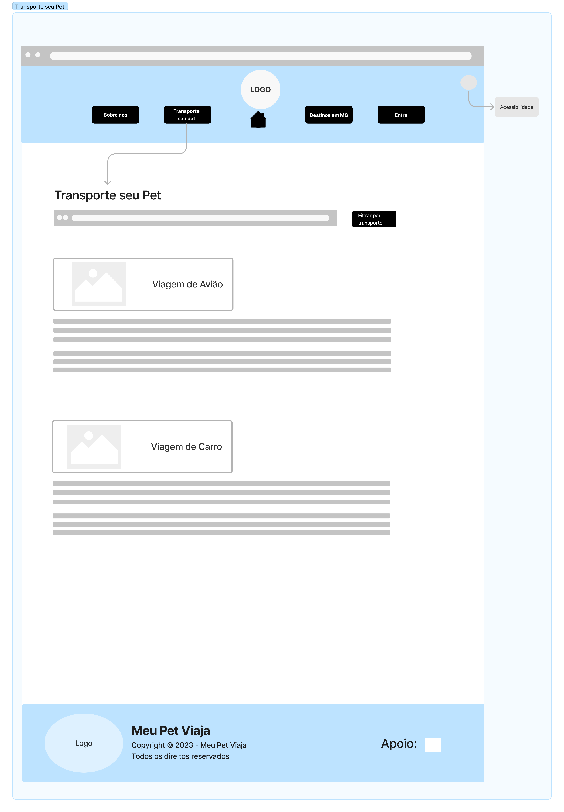

# Projeto de Interface

O projeto foi organizado em 5 páginas para facilitar a navegação e obtenção de informações para as viagens, sendo as paginas:  Homepage, Sobre Nós, Transporte seu pet, Destinos em MG, e Entre.  Em todas as páginas acessadas pelo usuário, há botões que redirecionam o usuário para a homepage ou a página anterior.

## User Flow

## Wireframes

### Homepage

A homepage apresenta todas as seções do site ("sobre nós", "transporte seu pet", "destinos em MG", "entre") que podem ser acessadas através dos botões localizados no menu navegação e os depoimentos cuja página pode ser acessada através do botão "Veja mais +" localizado no card "Depoimentos" no final da página que fará o redirecionamento para a página "Destinos em MG". No menu navegação, haverá uma opção de acessibilidade, conforme RNF-002. No card superior, logo abaixo do menu navegação, haverá um resumo das informações do projeto e um botão "Veja mais +" que redirecionará o usuário para a página "Sobre nós" e a logo do projeto. Mais abaixo terá um card com algumas opções de estabelecimentos. O botão "entre" redireciona o usuário para a página de login e, caso ele ainda não possua cadastro, poderá selecionar a opção de "criar nova conta" e ser redirecionado para a página "Cadastro". O layout da homepage determinará o layout das demais seções do site. No rodapé da homepage, encontram-se os direitos de uso do site, bem como a instituição de apoio do projeto.

### Sobre nós

Após clicar no botão "Veja mais +" na homepage, o usuário será direcionado para a página "Sobre nós". O menu navegação da  página é o mesmo da homepage e o card do topo da página possui a logo do projeto. Abaixo, se encontram fotos pessoais dos criadores com ou sem os seus pet que estarão acompanhadas por um breve texto contendo a apresentação do projeto, a sua motivação e seus objetivos. No rodapé da página, estão os direitos de uso do site e da instituição de apoio do projeto.

### Transporte seu Pet

Ao clicar no botão "Transporte seu Pet" contido na homepage, o usuário será direcionado para a página "Transporte seu Pet" na qual o menu navegação é o mesmo da homepage e o card do topo da página possui a logo do projeto. Abaixo, se encontram a opção de filtrar por transporte as regras de viagem de acordo com a necessidade do usuário. As opção cadastradas são avião, carro e ônibus, de acordo com as RF-001, RF-002 e RF-003. Cada seção pode ser indentificada pelo nome e foto que acompanham a sua especificidade de meio de transporte. No rodapé da página, estão os direitos de uso do site e da instituição de apoio do projeto.

### Destinos em MG

Ao clicar no botão "Destinos em MG" contido na homepage, o usuário será redirecionado para a página "Destinos em MG" na qual o menu navegação é o mesmo da homepage e o card do topo da página contém a logo do projeto. Abaixo se encontra uma opção de busca pelos destinos localizados em MG que são pet friendly, cujos filtros de pesquisa serão por tipo de estabelecimento ou cidade ou tipo de estabelecimento em determinada cidade. Mais abaixo aparecerão os destinos mais buscados e os estabelecimentos mais buscados. Também haverá um card com os últimos comentários feitos pelos usuários. No rodapé da página, estão os direitos de uso do site e da instituição de apoio do projeto.

### Depoimentos

Quando o usuário clicar no botão "Veja mais +", localizado no card "Depoimentos" da Homepage, será redirecionado para a página "Destinos em MG". A página "Destinos em MG" apresenta um filtro de busca onde o usuário pode pesquisar por cidade e/ou tipo de estabelecimento. Ao clicar em algum estabelecimento/ponto turístico, será redirecionado para a página do estabelecimento na qual haverá um formulário onde o usuário poderá deixar seu depoimento sobre o local pesquisado estando logado (o nome e a foto já estarão carregados) ou de forma anônima, conforme RF-007 e RF-012. Ao lado do formulário, aparecerão depoimentos de outros ou do próprio usuário, com a opção para curtir e comentar, conforme RF-013.

#### Cadastro de estabelecimento 
Quando o usuário clicar no botão "Cadastrar Estabelecimento" localizado na página Destinos em MG, será redirecionado para a página "Cadastro Estabelecimento". A página apresenta uma versão diferente da homepage, possui a logo e o nome do projeto na parte superior um banner com o título da página, na parte central a um formulários para o usuario preencher os dados cadastrais da empresa, podendo realizar o upload de uma fotos do estabelecimento e enviar as informações por meio de um botão. No rodapé da página, constam os direitos de uso e a instituição de apoio do projeto.

### Login

Quando o usuário clicar no botão "Entre" localizado no menu navegação da homepage, será redirecionado para a página Login que possui duas opções: ou a opção de inserir os dados para fazer o login para usuários que já possuem cadastro, ou a opção de criar nova conta para usuários que ainda não possuem cadastro no site. No rodapé da página, constam os direitos de uso e a instituição de apoio do projeto.

### Cadastro

Quando o usuário clicar no botão "Criar nova conta" localizado na página de "Login", será redirecionado para a página "Cadastro". A página apresenta o mesmo menu navegação da homepage e o card do topo da página possui a logo e uma foto de um pet. Mais abaixo, haverá dois botões para selecionar se o cadastro será do viajante ou do estabelecimento. Ao clicar no botão "viajante", será aberto um formulário onde o usuário conseguirá preencher seus dados cadastrais, fazer o upload de uma foto e enviar as informações através de um botão. Caso seja clicado no botão "estabelecimento", será redirecionado para a página de "Cadastro de estabelecimento". No rodapé da página, constam os direitos de uso e a instituição de apoio do projeto.

