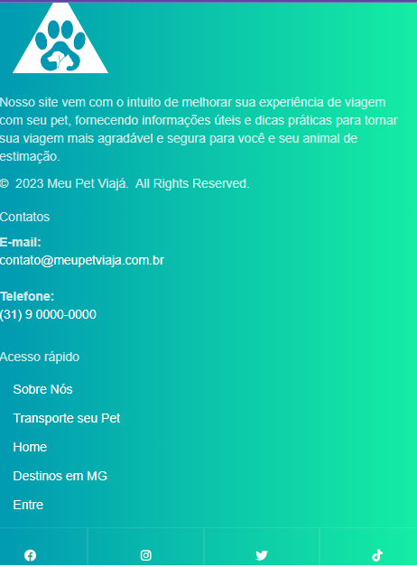

# Template padrão do site

<div align="center">


https://user-images.githubusercontent.com/69221221/236704608-dd7ac25a-b021-4c9a-b858-1bf5882021f7.mp4


</div>  

## Logo
<div align="center">

 

</div> 

## Design

## Header
<div align="center">

### Cabeçalho Desktop
  

### Cabeçalho Desktop


</div>  

<details>
  <summary>Header HTML</summary>

 ```html
<header class="header">
    <!--Logo -->
    <div class="logo">
        
    </div>
    <!--Logo -->
    <!--Cabeçalho-->
    <div class="navigation-bar">
        <ul class="nav">
              <li>
                <a href="#">Sobre Nós</a>
              </li>
              <li>
                <a href="#">Transporte seu Pet</a>
              </li>
              <li>
                <a href="index.html"><i class="fa-solid fa-house"></i></a>
              </li>
              <li>
                <a href="#">Destinos em MG</a>
              </li>
              <li>
                <a href="#">Entre</a>
              </li>
        </ul>
    </div>
    <!--Cabeçalho-->
     <!--Responsive Navbars-->
     <div class="responsive-navbar">
      <div class="collapse" id="navbarToggleExternalContent">
        <div class="p-4" style="background-color: #8cd4c8;">
          <h5 class="text-white h4">Meu Pet Viaja</h5>
          <ul class="nav-responsive">
            <li>
              <a href="index.html">Home</a>
            </li>
            <li>
              <a href="#">Sobre Nós</a>
            </li>
            <li>
              <a href="#">Transporte seu Pet</a>
            </li>
            <li>
              <a href="#">Destinos em MG</a>
            </li>
            <li>
              <a href="#">Entre</a>
            </li>
      </ul>
        </div>
      </div>
      <nav class="navbar-responsive navbar-dark bg-dark">
        <div class="container-fluid">
          <button class="navbar-toggler" type="button" data-bs-toggle="collapse" data-bs-target="#navbarToggleExternalContent" aria-controls="navbarToggleExternalContent" aria-expanded="false" aria-label="Toggle navigation">
            <span class="navbar-toggler-icon"></span>
          </button>
        </div>
      </nav>
     </div>
</header>

 ```
</details>

<details>
  <summary>Header CSS</summary>

  ```css
.logo{
    display: flex;
    justify-content: center;
    margin-top: 2rem;
}

.logo img{

    max-width: 350px;
    min-width: 250px;
   
}

.navbar{
    display: block;
    margin-left: auto;
    margin-right: auto;
}

.navigation-bar{
    display: flex;
    justify-content: center;
    margin-top: 2rem;
    margin-bottom: 2rem;

}

.navbar ul li
{
    align-self: center;
    list-style: none;
    margin-top: -50px;

}

.nav {
    width: 750px;
    display: flex;
    justify-content: space-around;
    flex-direction: row;
    margin-right: 55px;
}

.nav li a{
    border-radius: 25px;
    transition: 0.3s;
    color: black;
}

.nav li a:hover{
   padding-left: 25px;
   padding-right: 25px;
    color: white;
    background-color: cadetblue !important;
    cursor: pointer;
    border-radius: 25px;
    transition: 0.3s;
}

.responsive-navbar{
  display: none;
}
/**Navbar*/
```
</details>
--------------------------------------------------------------------------------------------------------------------------------------------------

## Main

## Carrossel (Desktop e Mobile)
 

  

<details>
  <summary>Main - Carrossel HTML</summary>

 ```html
 <!--image slider start-->
      <div class="slider">
          <div class="slides">
                <!--radio buttons start-->
                <input type="radio" name="radio-btn" id="radio1">
                <input type="radio" name="radio-btn" id="radio2">
                <input type="radio" name="radio-btn" id="radio3">
                <input type="radio" name="radio-btn" id="radio4">
                <!--radio buttons end-->
                <!--slide images start-->
              <div class="slide first">
                
              </div>
              <div class="slide">
                
              </div>
              <div class="slide">
                
              </div>
              <div class="slide">
                
              </div>
              <!--slide images end-->
              <!--automatic navigation start-->
              <div class="navigation-auto">
                <div class="auto-btn1"></div>
                <div class="auto-btn2"></div>
                <div class="auto-btn3"></div>
                <div class="auto-btn4"></div>
              </div>
            <!--automatic navigation end-->
          </div>
          <!--manual navigation start-->
          <div class="navigation-manual">
            <label for="radio1" class="manual-btn"></label>
            <label for="radio2" class="manual-btn"></label>
            <label for="radio3" class="manual-btn"></label>
            <label for="radio4" class="manual-btn"></label>
          </div>
          <!--manual navigation end-->
        </div>
      <!--image slider end-->
        <script type="text/javascript">
        var counter = 1;
        setInterval(function(){
          document.getElementById('radio' + counter).checked = true;
          counter++;
          if(counter > 4){
            counter = 1;
          }
        }, 5000);
        </script>
```
</details>

<details>
  <summary>Main - Carrossel CSS</summary>

  ```css
    /**carrosel*/
.slider{
 
    width: 100%;
    height: 500px;
    border-radius: 10px;
    overflow: hidden;
  }
  
  .slides{
    width: 500%;
    height: 500px;
    display: flex;
  }
  
  .slides input{
    display: none;
  }
  
  .slide{
    width: 20%;
    transition: 2s;
  }
  
  .slide img{
    width: 100%;
    height: 500px;
  }
  
  /*css for manual slide navigation*/
  
  .navigation-manual{
    position: absolute;
    width: 100%;
    margin-top: -40px;
    display: flex;
    justify-content: center;
  }
  
  .manual-btn{
    border: 2px solid #40D3DC;
    padding: 5px;
    border-radius: 10px;
    cursor: pointer;
    transition: 1s;
  }
  
  .manual-btn:not(:last-child){
    margin-right: 40px;
  }
  
  .manual-btn:hover{
    background: #40D3DC;
  }
  
  #radio1:checked ~ .first{
    margin-left: 0;
  }
  
  #radio2:checked ~ .first{
    margin-left: -20%;
  }
  
  #radio3:checked ~ .first{
    margin-left: -40%;
  }
  
  #radio4:checked ~ .first{
    margin-left: -60%;
  }
  
  /*css for automatic navigation*/
  
  .navigation-auto{
    position: absolute;
    display: flex;
    width: 100%;
    justify-content: center;
    margin-top: 460px;
  }
  
  .navigation-auto div{
    border: 2px solid #40D3DC;
    padding: 5px;
    border-radius: 10px;
    transition: 1s;
  }
  
  .navigation-auto div:not(:last-child){
    margin-right: 40px;
  }
  
  #radio1:checked ~ .navigation-auto .auto-btn1{
    background: #40D3DC;
  }
  
  #radio2:checked ~ .navigation-auto .auto-btn2{
    background: #40D3DC;
  }
  
  #radio3:checked ~ .navigation-auto .auto-btn3{
    background: #40D3DC;
  }
  
  #radio4:checked ~ .navigation-auto .auto-btn4{
    background: #40D3DC;
  }

  ```
</details>

## Cards Estabelecimentos 

<div align="center">

### Cards Estabelecimentos Desktop
  
  

### Cards Estabelecimentos Mobile


</div>

<details>
  <summary>Main - Cards Estabelecimentos HTML</summary>

 ```html
 <!--Cards-->
      <div class="container">
        <div class="cards-wrap">
          <div class="card">
              <div class="img">
                
              </div>

              <div class="content">
                  <span class="title">Patitas Lodge</span>
                  <p class="desc">Bem-vindo(a) à nossa hospedagem pet friendly! Aqui, seu amigo de quatro patas é mais do que bem-vindo, ele é tratado como um hóspede VIP! Temos uma grande área externa onde seu pet pode correr e brincar à vontade, além de um parque exclusivo para cães. Temos quartos confortáveis e aconchegantes para você e seu pet descansarem juntos, e se precisar sair para um passeio ou compromisso sem o seu amigo peludo, temos um serviço de pet sitter disponível para cuidar dele enquanto você estiver fora. Também oferecemos alimentação especializada para pets e estamos sempre prontos para atender às necessidades específicas de cada um. Venha se hospedar conosco e traga seu amigo peludo para desfrutar de uma experiência única e inesquecível!</p>
              </div>

              <div class="arrow">
                  <span>&#8673;</span>
              </div>
          </div>
          
          <div class="card">
            <div class="img">
                
            </div>

            <div class="content">
                <span class="title">Patareia Gourmet</span>
                <p class="desc">Bem-vindo ao nosso restaurante pet friendly, onde você pode desfrutar de uma deliciosa refeição na companhia do seu amigo peludo! Nós entendemos que seu animal de estimação é parte da família, e por isso criamos um ambiente acolhedor para receber tanto você quanto seu pet. Em nosso cardápio, oferecemos pratos saudáveis e saborosos tanto para humanos quanto para os pets, além de disponibilizarmos água fresca e tigelas para alimentação. Aqui, vocês podem relaxar e desfrutar juntos de momentos especiais, seja no almoço, jantar ou um simples lanche da tarde. Venha nos visitar e sinta-se em casa!</p>
            </div>

            <div class="arrow">
                <span>&#8673;</span>
            </div>
        </div>

        <div class="card">
          <div class="img">
              
          </div>

          <div class="content">
              <span class="title">Praça São José</span>
              <p class="desc">Bem-vindo à Praça Pata Amiga, um espaço público onde você e seu amigão de quatro patas são sempre bem-vindos! Aqui, além de desfrutar de um ambiente agradável e seguro para o seu pet, você também pode relaxar e aproveitar a natureza, conversar com amigos e conhecer novas pessoas que compartilham do amor pelos animais. Temos diversas opções de bancos e mesas para que você possa sentar e descansar enquanto seu pet se diverte em nossa área de recreação, equipada com obstáculos e brinquedos para todas as idades. Não se preocupe com a limpeza, nossa equipe está sempre atenta para garantir que o espaço esteja limpo e livre de resíduos. Venha nos visitar e sinta-se em casa com seu melhor amigo!</p>
          </div>

          <div class="arrow">
              <span>&#8673;</span>
          </div>
      </div>

      <div class="card">
        <div class="img">
            
        </div>

        <div class="content">
            <span class="title">Pata Lodge - Hospedagem Pet Friendly.</span>
            <p class="desc">Bem-vindo(a) à nossa hospedagem pet friendly! Aqui, seu amigo de quatro patas é mais do que bem-vindo, ele é tratado como um hóspede VIP! Temos uma grande área externa onde seu pet pode correr e brincar à vontade, além de um parque exclusivo para cães. Temos quartos confortáveis e aconchegantes para você e seu pet descansarem juntos, e se precisar sair para um passeio ou compromisso sem o seu amigo peludo, temos um serviço de pet sitter disponível para cuidar dele enquanto você estiver fora. Também oferecemos alimentação especializada para pets e estamos sempre prontos para atender às necessidades específicas de cada um. Venha se hospedar conosco e traga seu amigo peludo para desfrutar de uma experiência única e inesquecível!</p>
        </div>

        <div class="arrow">
            <span>&#8673;</span>
        </div>
    </div>

      </div>
    </div>
    <!--Cards-->

  ```
</details>

<details>
  <summary>Main - Cards Estabelecimentos CSS</summary>

 ```css

/**Cards*/
.cards-wrap{
    display: flex;
    flex-direction: row;
    flex-wrap: nowrap;
}
.card {
    border-radius: 16px;
    box-shadow: rgba(223, 233, 231, 0.35) 0px 5px 15px;
    cursor: pointer;
    width: 360px;
    display: flex;
    flex-direction: row;
    align-items: center;
    justify-content: center;
    position: relative;
    overflow: hidden;
    background-image: linear-gradient(#5f9ea0, #66989a);
    transition: all .5s;
    margin-left: 04px;
    margin-top: 15px;
    margin-bottom: 15px;
}

.card:hover {
    background-image: linear-gradient(cadetblue,#20b2aa, #008b8b);
}

.card .img {
    width: 360px;
    display: flex;
    justify-content: center;
    align-items: center;
    height: 200px;
    background-size: cover;
    background-position: center;
    transition: all .5s;
    z-index: 2;
    position: relative;
    opacity: .8;
}

.card .img span {
    text-transform: uppercase;
    font-size: 24px;
    font-weight: 100;
    font-style: italic;
    transition: all .5s;
}

.card:hover .img {
    width: 430px;
    opacity: 1;
}

.card:hover .img span {
    font-size: 28px;
}

.card .content {
    padding: 0px 20px;
    height: 0;
    opacity: 0;
    transition: all .5s;
    position: relative;
    box-sizing: border-box;
    overflow: hidden;
    transform: translateY(30px);
}

.card:hover .content {
    height: 260px;
    padding: 20px;
    opacity: 1;
    transform: translateY(0);
}

.card .content p {
    margin: 0;
}

.card .content .title {
    font-size: 20px;
    font-weight: 600;
}

.card .content .desc {
    font-size: 14px;
    font-weight: 100;
    opacity: .8;
    margin-top: 8px;
}

.card .arrow {
    padding: 15px;
    transform: rotate(-180deg);
    transition: all .5s;
}

.card:hover .arrow {
    transform: rotate(0);
}

.card .arrow span {
    font-size: 24px;
}
/**Cards*/
  ```
</details>


## Cards Depoimentos 

### Cards Depoimentos Desktop
   

### Cards Depoimentos Mobile


</div>

<details>
  <summary>Main - Cards Depoimentos HTML</summary>

 ```html
  <div class="container">
              <div class="locais-wrap">
                  <div class="local"> 
                    <div class="local_img"> 
                        
                    </div>
                    <div class="local_info"> 
                        <h3>Gabriel Lucca</h3>
                        <a href="#!">Lorem, ipsum dolor sit amet consectetur adipisicing elit. Obcaecati doloribus voluptas unde, autem iure ut esse ipsam facere magni quod totam velit omnis assumenda, qui beatae iste consequatur eveniet. Quisquam.</a>
                    </div>
                </div>
                <div class="local"> 
                  <div class="local_img"> 
                      
                  </div>
                  <div class="local_info"> 
                      <h3>Luana Lucia</h3>
                      <a href="#!">Lorem ipsum dolor sit amet consectetur adipisicing elit. Nobis quo accusamus hic iste beatae. Quia in id aut nulla dignissimos dolor officia et? Commodi odio neque doloribus eum quis delectus.</a>
                  </div>
              </div>
              <div class="local"> 
                <div class="local_img"> 
                    
                </div>
                <div class="local_info">
                    <h3>Thiago Borges</h3>
                    <a href="#!">Lorem ipsum dolor sit amet, consectetur adipisicing elit. Esse est at culpa vel veritatis eius provident ipsum, dignissimos, dolorum nemo, consequatur ullam hic neque optio? Assumenda voluptatum quaerat alias mollitia?</a>
                </div>
              </div>
              <div class="local">
                <div class="local_img">
                    
                </div>
                <div class="local_info">
                    <h3>Mirian Carla</h3>
                    <a href="#!">Lorem ipsum, dolor sit amet consectetur adipisicing elit. Suscipit repudiandae natus quibusdam excepturi voluptatum eveniet commodi quae nemo. Magni deserunt aliquam voluptatibus eligendi ipsa dolores natus quos rerum nesciunt aspernatur?</a>
                </div>
            </div>
              </div>
            </div>
  ```
</details>

<details>
  <summary>Main - Cards Depoimentos CSS</summary>

 ```css
/**Depoimentos*/
.locais-wrap{
    display: flex;
    flex-direction: row;
    flex-wrap: nowrap;
}
.local {
    border: 1px solid #ddd;
    border-radius: 6px;
    max-width: 350px;
    text-align: center;
    margin-top: 60px;
    margin-left: 15px;
    width: 360px;
    margin-bottom: 15px;
}
.local_img {
    width: 120px;
    height: 120px;
    overflow: hidden;
    border-radius: 100%;
    margin: -60px auto 0;
}
.local_img img {
    width: 100%;
    height: 100%;
    object-fit: cover;
}
.local_info {
    padding-bottom: 20px;
}
a {
  text-decoration: none;
  color: red;
}
a:hover{
  color: black;
}
/**Depoimentos*/

  ```
</details>

## Footer 

### Footer Desktop
   

### Footer Mobile


</div>

<details>
  <summary>Footer HTML</summary>

 ```html
 <footer class="section footer-classic context-dark bg-image" style="background: linear-gradient(to right, #0097b2,#15eea3);">
        <div class="container">
          <div class="row row-30">
            <div class="col-md-4 col-xl-5">
              <div class="pr-xl-4"><a class="brand" href="index.html"></a>
                <p>Nosso site vem com o intuito de melhorar sua experiência de viagem com seu pet, fornecendo informações úteis e dicas práticas para tornar sua viagem mais agradável e segura para você e seu animal de estimação.</p>
                <!-- Rights-->
                <p class="rights"><span>©  </span><span class="copyright-year">2023</span><span> </span><span>Meu Pet Viajá</span><span>. </span><span> All Rights Reserved.</span></p>
              </div>
            </div>
            <div class="col-md-4">
              <h5>Contatos</h5>
              <dl class="contact-list">
                <dt> E-mail:</dt>
                <dd><a href="mailto:#">contato@meupetviaja.com.br</a></dd>
              </dl>
              <dl class="contact-list">
                <dt>Telefone:</dt>
                <dd><a href="tel:#">(31) 9 0000-0000</a>
                </dd>
              </dl>
            </div>
            <div class="col-md-4 col-xl-3">
              <h5>Acesso rápido</h5>
              <ul class="nav-list">
                <li><a href="#">Sobre Nós</a></li>
                <li><a href="#">Transporte seu Pet</a></li>
                <li><a href="#">Home</a></li>
                <li><a href="#">Destinos em MG</a></li>
                <li><a href="#">Entre</a></li>
              </ul>
            </div>
          </div>
        </div>
        <div class="row no-gutters social-container">
          <div class="col"><a class="social-inner" href="#"><span class="icon mdi mdi-facebook"></span><span><i class="fa-brands fa-facebook"></i></span></a></div>
          <div class="col"><a class="social-inner" href="#"><span class="icon mdi mdi-instagram"></span><span><i class="fa-brands fa-instagram"></i></span></a></div>
          <div class="col"><a class="social-inner" href="#"><span class="icon mdi mdi-twitter"></span><span><i class="fa-brands fa-twitter"></i></span></a></div>
          <div class="col"><a class="social-inner" href="#"><span class="icon mdi mdi-youtube-play"></span><span><i class="fa-brands fa-tiktok"></i></span></a></div>
        </div>
      </footer>
  ```
</details>

<details>
  <summary>Footer CSS</summary>

 ```css
/**Footer*/
.context-dark, .bg-gray-dark, .bg-primary {
    color: rgba(255, 255, 255, 0.8);
}

.footer-classic a, .footer-classic a:focus, .footer-classic a:active {
    color: #ffffff;
}
.nav-list li {
    padding-top: 5px;
    padding-bottom: 5px;
}

.nav-list li a:hover:before {
    margin-left: 0;
    opacity: 1;
    visibility: visible;
}

ul, ol {
    list-style: none;
    padding: 0;
    margin: 0;
}

.social-inner {
    display: flex;
    flex-direction: column;
    align-items: center;
    width: 100%;
    padding: 23px;
    font: 900 13px/1 "Lato", -apple-system, BlinkMacSystemFont, "Segoe UI", Roboto, "Helvetica Neue", Arial, sans-serif;
    text-transform: uppercase;
    color: rgba(255, 255, 255, 0.5);
}
.social-container .col {
    border: 1px solid rgba(255, 255, 255, 0.1);
}
.nav-list li a:before {
    content: "\f14f";
    font: 400 21px/1 "Material Design Icons";
    color: #4d6de6;
    display: inline-block;
    vertical-align: baseline;
    margin-left: -28px;
    margin-right: 7px;
    opacity: 0;
    visibility: hidden;
    transition: .22s ease;
}
/**Footer*/

  ```
</details>


## Cores

A paleta de cores do projeto é composta das seguintes cores:


Sendo as cores #00977B2, #4ECDC4 e #15EEA3, as cores presentes na logo e as cores que dão personalidade e estão em maior destaque no site. Já as cores #FFFFFF e #000000 são as cores utilizadas para dar contraste e, em especial, a segunda será utlizada no corpo do texto do site.

## Tipografia

### Título
#### Monstserrat extra-bold

### Corpo
#### Merriweather

### Destaque
#### Alegrya bold


## Iconografia


